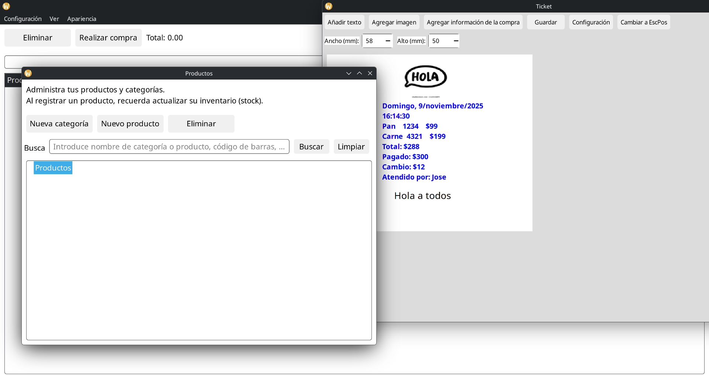
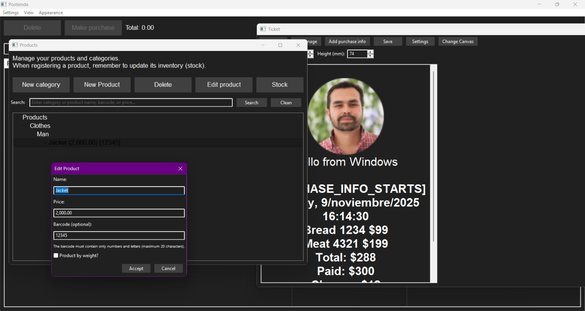

# wxWidgets Setup Guide

This guide explains how to download, compile, and install **wxWidgets 3.3.1+** on **Windows** and **Linux** for static builds.

---

## Download

Download the source code from [wxWidgets official website](https://www.wxwidgets.org/downloads/) and extract it. Use version **3.3.1 or higher**.

---

## Windows

1- Extract and add root to path environment and name it WXWIN

2- Go to ```\build\msw```

3- Compile to x64 release static: ```nmake /f makefile.vc BUILD=release SHARED=0 CFG=release TARGET_CPU=amd64 OBJDIR_SUFFIX=rl```

4- Compile to x64 debug static: ```nmake /f makefile.vc BUILD=debug SHARED=0 CFG=debug TARGET_CPU=amd64 OBJDIR_SUFFIX=drl```

5- After that folders with vc_x64_librelease and vc_x64_libdebug will be created


## Linux:

1- Install:   ```gcc-c++ make automake autoconf libtool \
  gtk3-devel \
  libjpeg-turbo-devel \
  libpng-devel \
  libtiff-devel \
  zlib-devel \
  expat-devel \
  webp-devel \
  pcre2-devel \
  gstreamer1-devel gstreamer1-plugins-base-devel```

2- Download source code and extract

3- ```cd wxWidgets-3.3.1```, then ```mkdir gtk-build``` and ```cd gtk-build```

4- ```../configure \
  --prefix=/opt/wxlinux \
  --with-gtk=3 \
  --disable-shared \
  --enable-richtext \
  --enable-stc \
  --enable-xrc \
  --enable-html \
  --with-libpng=sys \
  --with-libjpeg=sys \
  --with-libtiff=sys \
  --with-regex=sys```

5- Compile: ```make -j$(nproc)```

6- Install wxWidgets on /opt/wxlinux: ```sudo make install```

7- Update cache: ```sudo ldconfig```

8- Add to path, so cmake can find it, edit path with: ```nano ~/.bashrc```

9- Add at the end of the file: ```export PATH=/opt/wxlinux/bin:$PATH```

10- Save and reload with: ```source ~/.bashrc```


## Demonstration:

Linux:




Windows


